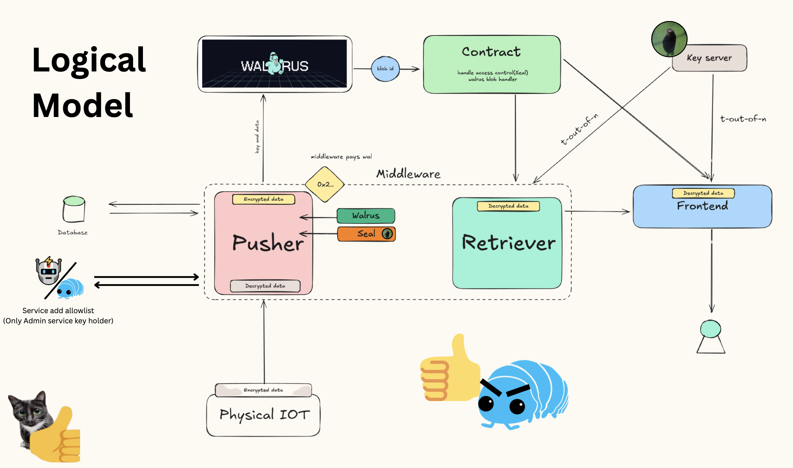

# Isopod 
## 📖 About

**Isopod** is a comprehensive security research and demonstration project by the **Isopod Team** focused on showcasing overflow vulnerabilities in the Sui blockchain ecosystem using the Move language. It began as a solution to address real-world issues in **supply chain transportation transparency**, especially for sensitive goods like vaccines or pharmaceuticals.

Traditional tracking systems in logistics are opaque, often relying on **manual data entry** and **delayed reporting**, which can lead to falsified records and slow interventions. **Isopod** proposes a novel architecture that combines **IoT devices**, **Sui blockchain**, **Walrus storage**, and **Seal technology** to address these challenges.

### 🔐 Highlights

- Transparent, tamper-proof monitoring via smart contracts
- Real-time integration of IoT sensor data into the blockchain
- Modular architecture for easy expansion and testing

The project also explores next steps in both software and hardware:
- Design a hardware solution that offers the same level of safety and integrity as the Sui blockchain.

The Isopod framework is not just a teaching tool but a practical solution model for modern logistics and decentralized transparency.

 

---

## 📋 Overview

This project highlights vulnerabilities and protections related to:

- ✅ Integer overflow/underflow
- 🔁 Stack overflow via recursive calls
- 🚫 Bytecode verifier bypass
- 🔬 Security mitigation testing

> **Note**: The Sui Move language automatically aborts transactions on overflow/underflow to prevent vulnerabilities from faulty arithmetic.

---

## 🏗️ Project Structure

```
Sui-overflow-x1/
├── DataLocker/          # Data storage and manipulation modules
├── develop/             # Core development and exploit code
├── frontend/            # Web interface for testing
├── middleware/          # API and service layer
└── README.md            # This file
```
<!---

---

## 🔧 How to Build

### ✅ Prerequisites

Make sure you have the following installed:

1. **Sui CLI**
   ```bash
   cargo install --locked --git https://github.com/MystenLabs/sui.git --branch devnet sui
   ```

2. **Node.js (v18+) and npm**  
   Download from: [https://nodejs.org](https://nodejs.org)

3. **Rust toolchain**
   ```bash
   curl --proto '=https' --tlsv1.2 -sSf https://sh.rustup.rs | sh
   rustup update stable
   ```

---

### 🛠️ Build Process

#### Clone and Set Up

```bash
git clone https://github.com/BigdraCo1/Sui-overflow-x1.git
cd Sui-overflow-x1
```

#### Build Move Contracts

```bash
cd Develop
sui move build
```

#### Build Frontend

```bash
cd ../frontend
npm install
npm run build
```

#### Build Middleware

```bash
cd ../middleware
yarn install
yarn run build
```

---

## 🚀 Getting Started

### Environment Setup

```bash
# Initialize Sui configuration
sui client new-env --alias testnet --rpc https://fullnode.testnet.sui.io:443
sui client switch --env testnet

# Create a new wallet (save the mnemonic!)
sui client new-address ed25519
```

### Get Test Tokens

```bash
sui client faucet
```

### Deploy Contracts

```bash
cd develop
sui client publish --gas-budget 20000000
```

**We're using this contract in our project(deployed on testnet)**

```bash
0x0fa339e890387266ca3463d2277d2670abb9095351bd6d7c894e7a076c320d3d
```

---

### Start Development Environment

**Terminal 1 - Backend Services**
```bash
cd middleware
docker-compose up -d
yarn prisma migrate deploy
yarn run start
```

**Terminal 2 - Frontend**
```bash
cd frontend
npm run dev
```

Open your browser at [http://localhost:5173](http://localhost:5173)

---

## 🧪 Running Tests

### Basic Overflow Tests

```bash
cd DataLocker
sui move test
```

### Integer Overflow Test

```bash
sui client call   --package <PACKAGE_ID>   --module overflow_test   --function test_integer_overflow   --args 18446744073709551615 1   --gas-budget 10000000
```

### Stack Overflow Test

```bash
sui client call   --package <PACKAGE_ID>   --module stack_test   --function recursive_call   --args 10000   --gas-budget 10000000
```

---

## 📊 Expected Results

### ✅ Successful Overflow Detection

```
Transaction Effects Status: Success  
Events Emitted: OverflowDetected { value: 18446744073709551615, increment: 1 }  
Gas Used: 1,234,567
```

### 🚫 Stack Overflow Prevention

```
Error: MoveAbort(MoveLocation {
  module: ModuleId { address: 0x..., name: Identifier("stack_test") },
  function: 2, instruction: 15,
  function_name: Some("recursive_call")
}, 1)
```

> Demonstrates Sui Move VM’s protection against stack overflow via automatic transaction abortion.

---
